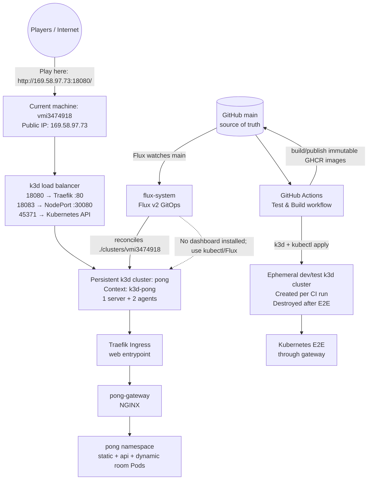

# 🏓 Cloud Native Pong

A minimalist, horizontally-scalable PONG game running on Kubernetes. Each game room is a dedicated pod — demonstrating the power of cloud-native architecture with near-zero overhead.

## ✨ Features

- **Zero-auth** — Just pick a name and play. No accounts, no passwords.
- **1 room = 1 pod** — Every game room runs in its own isolated pod. Scale infinitely.
- **Blazing fast** — Go binary (~6 MB), `scratch` container image, sub-millisecond WebSocket messages.
- **Embedded SQLite** — Pure Go, CGO-free, no external database needed.
- **Self-cleaning** — Rooms auto-terminate when the game ends. No orphaned pods.
- **Multi-service** — Gateway, static, API, room: each scales independently.

## 🏗 Architecture

```
                     ┌──────────────┐
                     │   Gateway    │  (NGINX, 1 replica, NodePort)
                     │   :80        │
                     └──────┬───────┘
        ┌───────────────────┼───────────────────┐
        ▼                   ▼                   ▼
 ┌──────────┐     ┌──────────────┐     ┌──────────────┐
 │  Static   │     │   API/Lobby  │     │  Room Pods   │
 │ (nginx)  │     │  (Go, 1 rep) │     │ (Go, dynamic)│
 │  /        │     │  /api/*      │     │  /rooms/*    │
 └──────────┘     └──────┬───────┘     └──────────────┘
                         │ SQLite (PVC)
                         │ K8s API (creates room pods)
```

### Component responsibilities

| Component | Image | Replicas | Purpose |
|-----------|-------|----------|---------|
| **Gateway** | `cloudnativepong-gateway` | 1 | NGINX entry point, routes by path |
| **Static** | `cloudnativepong-static` | 1 | Serves HTML, CSS, JS via nginx |
| **API** | `cloudnativepong-api` | 1 | Room CRUD, K8s pod orchestration, WebSocket proxy |
| **Room** | `cloudnativepong-room` | N (dynamic) | One pod per game, runs PONG engine |

### Routing

```
/              → Static (index.html)
/api/*         → API (room management)
/rooms/{id}/ws → API (proxies to room pod WebSocket)
```

## 🚀 Quick Start

### Local Development (no Kubernetes)

```bash
# Single binary, lobby + rooms + static in one process
go run . --mode=local

# Open http://localhost:8080
```

### Docker Compose (local multi-service)

```bash
# Build all images
docker build -t cloudnativepong-api:latest -f Dockerfile.api .
docker build -t cloudnativepong-room:latest -f Dockerfile.room .
docker build -t cloudnativepong-static:latest -f Dockerfile.static .
docker build -t cloudnativepong-gateway:latest -f Dockerfile.gateway .

# Run with docker-compose (create a compose file or use k3d)
```

### On Kubernetes (k3d for local, any K8s for prod)

```bash
# Create a local K8s cluster (fast feedback loop).
# Map host port 8080 to this app's gateway NodePort 30080.
k3d cluster create pong --agents 2 --port 8080:30080@agent:0

# Build and load images
podman build -t cloudnativepong-api:latest -f Dockerfile.api .
podman build -t cloudnativepong-room:latest -f Dockerfile.room .
podman build -t cloudnativepong-static:latest -f Dockerfile.static .
podman build -t cloudnativepong-gateway:latest -f Dockerfile.gateway .
k3d image import cloudnativepong-api:latest cloudnativepong-room:latest \
  cloudnativepong-static:latest cloudnativepong-gateway:latest -c pong

# Deploy
kubectl apply -f k8s/all.yaml

# Open http://localhost:8080
```

## 🌐 Environments, Operations, and GitOps

### Public play URL

The currently deployed public application is available at:

**[http://169.58.97.73:18080/](http://169.58.97.73:18080/)**

Open that URL, enter a display name, and create or join a room. This endpoint
supports the browser WebSocket connection used by the game. It is HTTP-only at
present; HTTPS/TLS has not been configured.

The endpoint was checked on 2026-07-31 and returned HTTP 200. The application
health and lobby API also returned successfully:

```text
GET http://169.58.97.73:18080/health    → 200 OK
GET http://169.58.97.73:18080/api/rooms  → 200 OK
```

### Cluster layout

There are **not currently two persistent Kubernetes clusters** for this project.
The current machine hosts the public/production-like k3d cluster. Development
and Kubernetes integration tests use a separate **ephemeral** k3d cluster that
is created and destroyed by the GitHub Actions workflow; it is not a second
always-on public environment.



The diagram's two Kubernetes boxes represent two different roles: the
persistent public target on the current machine, and the disposable CI test
cluster. Only `pong` is currently running on the machine and exposed publicly.


| Role | kubeconfig context | Cluster | Access | Status |
|------|--------------------|---------|--------|--------|
| Development and public deployment target | `k3d-pong` | `pong` | Local k3d API; public app through the URL above | Running; 3 Ready nodes and all Pong deployments available |

The cluster has one server, two agents, and a load balancer. The `pong`
namespace contains the game, while `flux-system` contains the GitOps
controllers. The public route is Traefik → `pong-gateway` → the static/API
services. The NodePort remains available for local diagnostics at port `30080`.

To inspect the cluster when the k3d host is available:

```bash
kubectl config use-context k3d-pong
kubectl get nodes -o wide
kubectl -n pong get deploy,pods,svc,ingress,hpa,pvc
kubectl -n flux-system get pods
```

If a separate dev cluster or separately managed public cluster is added later,
it should have its own kubeconfig context and a separate directory under
`clusters/`; it should not be inferred from the current `k3d-pong` context.

### GitOps workflow

Kubernetes application changes are managed with **Flux v2 GitOps**. Git is the
source of truth; do not use a manual `kubectl apply` as the permanent production
deployment mechanism.

1. Work locally and run the Go, lint, and Playwright tests. Pull requests run
   local-mode E2E tests and build all four container images. The Kubernetes E2E
   job also creates a disposable k3d cluster and tests through the gateway.
2. Merge the reviewed change into `main`.
3. `.github/workflows/publish-images.yml` builds and publishes immutable
   `sha-<commit>` images to GHCR for `api`, `room`, `static`, and `gateway`.
4. The workflow updates `k8s/overlays/server/` with those image tags and commits
   the generated deployment update.
5. Flux watches `main` at one-minute source intervals and reconciles
   `./clusters/vmi3474918` (which deploys `./k8s/overlays/server`) every ten
   minutes. Force an immediate sync when needed:

   ```bash
   flux reconcile source git flux-system -n flux-system
   flux reconcile kustomization flux-system -n flux-system --with-source
   flux get sources git -A
   flux get kustomizations -A
   ```

The Flux source and kustomization should both report `Ready=True` after a
successful deployment. The generated Flux bootstrap manifests are under
`clusters/vmi3474918/flux-system`; application manifests and environment
patches are under `k8s/overlays/server/`.

### Kubernetes dashboards and administrative access

No Kubernetes web dashboard (Kubernetes Dashboard, Headlamp, Lens server, or
similar) is installed in the current cluster. Consequently there is no
browser dashboard URL for either a separate dev cluster or a separate public
cluster. The project currently has one cluster, and it is administered with
`kubectl` and observed with Flux:

```bash
kubectl config use-context k3d-pong
kubectl get pods -A
kubectl -n pong get deploy,pods,svc,ingress,hpa,pvc
kubectl -n flux-system get pods
flux get sources git -A
flux get kustomizations -A
```

The public game URL is intentionally not a Kubernetes dashboard and does not
provide cluster-administration access. If a dashboard is installed in the
future, expose it through an authenticated, private access path (for example,
port-forwarding or an identity-aware proxy) rather than adding it to the public
Pong ingress.

## 🧪 Testing

```bash
# Local mode (fast dev)
npx playwright test

# K8s mode (full integration; the cluster gateway must already be running)
TEST_MODE=k8s npx playwright test
```

## 🔌 WebSocket Proxy Design

Kubernetes traffic enters through the NGINX gateway. It routes REST requests to the Go lobby, static assets to the static service, and `/rooms/{id}/ws` to the lobby's room proxy. The lobby then opens a second WebSocket connection to the dynamically created room pod.

The lobby keeps the browser-facing HTTP connection hijacked because the gateway must receive the lobby's `101 Switching Protocols` response before it can enter WebSocket tunnel mode. The room-side connection uses `gorilla/websocket`, rather than copying the underlying TCP socket, so bytes buffered during the room handshake and WebSocket control frames are preserved.

Room capacity reservations and actual connections are separate lifecycle events: creating a room reserves the creator's slot, `/api/rooms/join` reserves the opponent's slot, and the room Pod calls the internal `started` callback only after both WebSockets are accepted. A disconnect or game completion calls the `finished` callback, while a waiting room that never starts expires after 10 minutes. The lobby reconciles these waiting rooms every minute. The internal callbacks are reachable through the API ClusterIP only, not through the public gateway.

The browser sends a small `{"type":"proxy-ready"}` message immediately after `WebSocket.onopen`. The lobby consumes that marker, releases the first room-to-browser frames only after the outer gateway handoff, and forwards all subsequent application messages. The browser-to-room relay validates masked client frames, reassembles fragmented messages, handles control frames, and enforces a 16 MiB message limit. The marker is harmless in local mode, where the browser connects directly to the in-process room handler.

NGINX's `/rooms/` location explicitly enables HTTP/1.1 upgrade headers, disables request/response buffering, and uses one-hour WebSocket timeouts. See `gateway/nginx.conf` and `main.go` for the two sides of the handoff.

## 📊 Verification Status

- Local Go tests, race tests, vet, and static builds pass.
- The local Playwright suite passes 12/12.
- Isolated Chromium checks through the NGINX k3d gateway pass, including two-player joining.
- The full k3d suite passes 12/12 when host traffic is mapped to the gateway NodePort with `8080:30080@agent:0`. The earlier intermittent 11/12 result came from using the cluster's port-80 ingress path or an unstable `kubectl port-forward`, not from a reproducible room/proxy failure.

## 📁 Project Structure

```
.
├── main.go              # Entry point, routing, CORS, WS proxy
├── main_test.go         # WebSocket frame and relay tests
├── lobby/               # Lobby server (room management, K8s integration)
├── game/                # PONG game engine (server-side state machine)
├── db/                  # SQLite database layer
├── static/              # Frontend (HTML, CSS, vanilla JS)
│   └── nginx.conf       # nginx config for static pod
├── gateway/             # Gateway config
│   └── nginx.conf       # NGINX routing and WebSocket upgrade rules
├── k8s/                 # Kubernetes manifests
│   └── all.yaml         # All resources: gateway, static, api, RBAC, ConfigMap
├── tests/               # Playwright E2E tests
├── Dockerfile.api       # Go binary → scratch (lobby mode)
├── Dockerfile.room      # Go binary → scratch (room mode)
├── Dockerfile.static    # nginx:alpine + static files
├── Dockerfile.gateway   # nginx:alpine + gateway/nginx.conf
├── HANDOFF.md           # Current implementation state and next steps
└── README.md
```

## 🔧 Tech Stack

| Layer          | Choice                        | Why                                      |
| -------------- | ----------------------------- | ---------------------------------------- |
| Language       | Go 1.25+                      | Single binary, no runtime, tiny images   |
| Database       | SQLite (modernc.org/sqlite)   | Pure Go, embedded, zero ops              |
| WebSocket      | gorilla/websocket             | Battle-tested, minimal API               |
| Gateway        | NGINX                         | Kubernetes-friendly HTTP/WebSocket proxy |
| Static Server  | nginx:alpine                  | Battle-tested, tiny footprint            |
| Container      | `scratch` (Go), `alpine` (others) | Smallest possible images              |
| Frontend       | Vanilla JS + Canvas           | No framework, instant load               |
| E2E Testing    | Playwright + TypeScript       | Reliable, cross-browser                  |
| Local K8s      | k3d                           | Lightweight, fast startup (~10s)         |

## 🎮 How to Play

1. Open the lobby page.
2. Enter a display name.
3. Click **New Room** (and share the link) or **Join** an existing room.
4. Use **W/S** (Player 1) or **↑/↓** (Player 2) to move your paddle.
5. First to 7 points wins!

---

**Made to demonstrate cloud-native scalability with minimal complexity.**