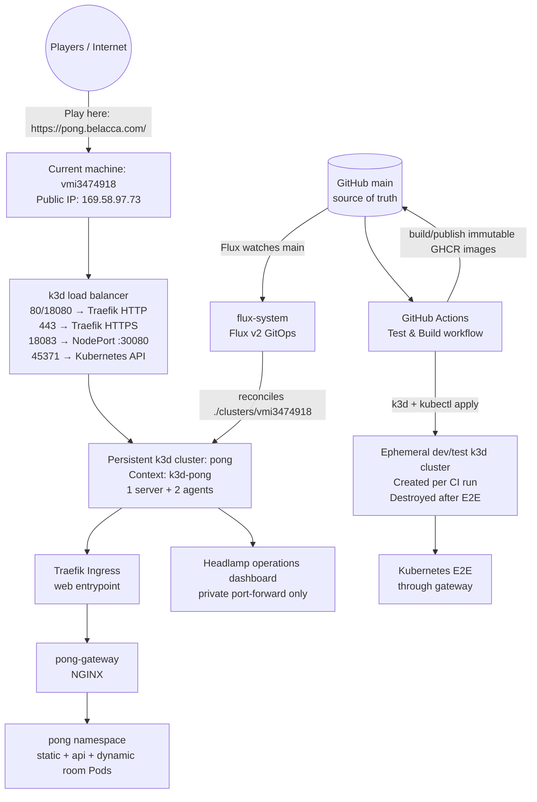

# 🏓 Cloud Native Pong

A minimalist, horizontally-scalable PONG game running on Kubernetes. Each game room is a dedicated pod — demonstrating the power of cloud-native architecture with near-zero overhead.

## ✨ Features

- **Zero-auth** — Just pick a name and play. No accounts, no passwords.
- **1 room = 1 pod** — Every game room runs in its own isolated pod. Scale infinitely.
- **Blazing fast** — Go binary (~6 MB), `scratch` container image, sub-millisecond WebSocket messages.
- **Embedded SQLite** — Pure Go, CGO-free, no external database needed.
- **Self-cleaning** — Rooms auto-terminate when the game ends. No orphaned pods.
- **Multi-service** — Gateway, static, API, room: each scales independently.
- **Play vs Computer** — A deterministic browser-side heuristic AI works offline; no LLM, model, or network service is required.
- **Mobile-ready** — Responsive canvas layout and touch paddle controls work alongside keyboard controls.

## 🏗 Architecture

```
                     ┌──────────────┐
                     │   Gateway    │  (NGINX, 1 replica, NodePort)
                     │   :80        │
                     └──────┬───────┘
        ┌───────────────────┼───────────────────┐
        ▼                   ▼                   ▼
 ┌──────────┐     ┌──────────────┐     ┌──────────────┐
 │  Static   │     │   API/Lobby  │     │  Room Pods   │
 │ (nginx)  │     │  (Go, 1 rep) │     │ (Go, dynamic)│
 │  /        │     │  /api/*      │     │  /rooms/*    │
 └──────────┘     └──────┬───────┘     └──────────────┘
                         │ SQLite (PVC)
                         │ K8s API (creates room pods)
```

### Component responsibilities

| Component | Image | Replicas | Purpose |
|-----------|-------|----------|---------|
| **Gateway** | `cloudnativepong-gateway` | 2 production / 1 local | NGINX entry point, routes by path |
| **Static** | `cloudnativepong-static` | 2 production / 1 local | Serves HTML, CSS, JS via nginx |
| **API** | `cloudnativepong-api` | 1 | Room CRUD, K8s pod orchestration, WebSocket proxy |
| **Room** | `cloudnativepong-room` | N (dynamic) | One pod per game, runs PONG engine |

### Routing

```
/              → Static (index.html)
/api/*         → API (room management)
/rooms/{id}/ws → API (proxies to room pod WebSocket)
```

## 🚀 Quick Start

### Local Development (no Kubernetes)

```bash
# Single binary, lobby + rooms + static in one process
go run . --mode=local

# Open http://localhost:8080
```

The lobby also provides **Play vs Computer (AI)**. This mode runs entirely in
the browser: it uses a small deterministic prediction heuristic, does not create
a server room, and does not call an LLM or any external service. Keyboard W/S
and the on-screen Up/Down touch buttons control the human paddle.

The workspace [fast development-loop guide](https://github.com/macel94/belacca-platform/blob/main/docs/development-loop.md)
describes why local process mode is the default inner loop, how Kubernetes-
dependent changes should use an isolated warm development environment, and why
the public `k3d-pong` cluster and Flux promotion path must not be used for every
edit.

### Docker Compose (local multi-service)

```bash
# Build all images
docker build -t cloudnativepong-api:latest -f Dockerfile.api .
docker build -t cloudnativepong-room:latest -f Dockerfile.room .
docker build -t cloudnativepong-static:latest -f Dockerfile.static .
docker build -t cloudnativepong-gateway:latest -f Dockerfile.gateway .

# Run with docker-compose (create a compose file or use k3d)
```

### On Kubernetes (k3d for local, any K8s for prod)

```bash
# Create a local K8s cluster (fast feedback loop).
# Map host port 8080 to this app's gateway NodePort 30080.
k3d cluster create pong --agents 2 --port 8080:30080@agent:0

# Build and load images
podman build -t cloudnativepong-api:latest -f Dockerfile.api .
podman build -t cloudnativepong-room:latest -f Dockerfile.room .
podman build -t cloudnativepong-static:latest -f Dockerfile.static .
podman build -t cloudnativepong-gateway:latest -f Dockerfile.gateway .
k3d image import cloudnativepong-api:latest cloudnativepong-room:latest \
  cloudnativepong-static:latest cloudnativepong-gateway:latest -c pong

# Deploy
kubectl apply -f k8s/all.yaml

# Open http://localhost:8080
```

## 🌐 Environments, Operations, and GitOps

### Public play URL

Cloud Native Pong is hosted at:

- **[https://pong.belacca.com/](https://pong.belacca.com/)**

The apex names `belacca.com` and `www.belacca.com` redirect to the personal
site at `https://francesco.belacca.com/`. Open the Pong subdomain, enter a
display name, and create or join a room. Browser WebSocket connections are
served over TLS. Let's Encrypt certificates are issued and renewed
automatically by Traefik, with certificate state stored in the
`kube-system/traefik-acme` PVC.

Host-based routing is owned by the public
[`macel94/belacca-gitops`](https://github.com/macel94/belacca-gitops) repository;
this repository owns Pong workloads and immutable images. DNS must contain A
records for `pong.belacca.com` and `francesco.belacca.com` pointing to
`169.58.97.73` for normal traffic. ACME uses the platform's Cloudflare DNS-01
configuration and its out-of-band `kube-system/traefik-cloudflare` Secret; no
DNS/API value is stored here.

### Cluster layout

There are **not currently two persistent Kubernetes clusters** for this project.
The current machine hosts the public/production-like k3d cluster. Development
and Kubernetes integration tests use a separate **ephemeral** k3d cluster that
is created and destroyed by the GitHub Actions workflow; it is not a second
always-on public environment.



The diagram's two Kubernetes boxes represent two different roles: the
persistent public target on the current machine, and the disposable CI test
cluster. Only `pong` is currently running on the machine and exposed publicly.


| Role | kubeconfig context | Cluster | Access | Status |
|------|--------------------|---------|--------|--------|
| Development and public deployment target | `k3d-pong` | `pong` | Local k3d API; public app through the URL above | Running; 3 Ready nodes and all Pong deployments available |

The cluster has one server, two agents, and a load balancer. The `pong`
namespace contains the game, while `flux-system` contains the GitOps
controllers. The Pong route is Traefik → `pong-gateway` → the static/API
services. Host-based routing is declared in
`macel94/belacca-gitops`; this repository does not expose a wildcard or apex
Ingress. The NodePort remains available for local diagnostics at port `30080`.

To inspect the cluster when the k3d host is available:

```bash
kubectl config use-context k3d-pong
kubectl get nodes -o wide
kubectl -n pong get deploy,pods,svc,ingress,hpa,pvc
kubectl -n flux-system get pods
```

If a separate dev cluster or separately managed public cluster is added later,
it should have its own kubeconfig context and a separate directory under
`clusters/`; it should not be inferred from the current `k3d-pong` context.

### GitOps workflow

Kubernetes application changes are managed with **Flux v2 GitOps**. Git is the
source of truth; do not use a manual `kubectl apply` as the permanent production
deployment mechanism. The cluster-level source of truth is
[`macel94/belacca-gitops`](https://github.com/macel94/belacca-gitops); this
repository is one independently reconciled application source.

1. Work locally and run the Go, lint, and Playwright tests. Pull requests run
   local-mode E2E tests and build all four container images. The Kubernetes E2E
   job also creates a disposable k3d cluster and tests through the gateway.
2. Merge the reviewed change into `main`.
3. `.github/workflows/publish-images.yml` builds and publishes immutable
   `sha-<commit>` images to GHCR for `api`, `room`, `static`, and `gateway`.
4. The workflow updates `k8s/overlays/server/` with those image tags and commits
   the generated deployment update.
5. Flux watches `main` at one-minute source intervals and reconciles
   `./clusters/vmi3474918` (which deploys `./k8s/overlays/server`) every ten
   minutes. Force an immediate sync when needed:

   ```bash
   flux reconcile source git flux-system -n flux-system
   flux reconcile kustomization flux-system -n flux-system --with-source
   flux get sources git -A
   flux get kustomizations -A
   ```

The Flux source and kustomization should both report `Ready=True` after a
successful deployment. The generated Flux bootstrap manifests are under
`clusters/vmi3474918/flux-system`; application manifests and environment
patches are under `k8s/overlays/server/`.

### Kubernetes dashboards and administrative access

#### Installed dashboard: Headlamp

[Headlamp](https://headlamp.dev/) is installed by Flux from the pinned official
Headlamp Helm chart (`0.44.0`). Its Service is `ClusterIP` only, there is no
Ingress or NodePort, and it is not connected to the public Pong route. The
installation is declared under `clusters/vmi3474918/headlamp/`; do not install
or upgrade it manually with `kubectl` or Helm.

The dashboard's pod uses a dedicated ServiceAccount bound to the
`headlamp-read-only` ClusterRole. That role permits `get`, `list`, and `watch`
for cluster observability, including Flux resources, but no create/update/delete
operations. It does not grant access to Secret values. Headlamp's own
`unsafeUseServiceAccountToken` and Helm-operation features are disabled.

To access it securely from this machine, use the existing kubeconfig context
and a localhost-only port-forward. Keep this command running while using the
browser:

```bash
kubectl config use-context k3d-pong
kubectl -n headlamp port-forward --address 127.0.0.1 service/headlamp 8080:80
```

Then open **[http://127.0.0.1:8080/](http://127.0.0.1:8080/)** on the machine. Headlamp
will ask for a Kubernetes bearer token. Generate a short-lived token locally
and paste it directly into the browser; do not print, log, commit, or send the
token anywhere:

```bash
kubectl -n headlamp create token headlamp --duration=1h
```

The port-forward binds to localhost by default. Do not expose it with a public
Ingress, NodePort, or load balancer. If remote access is ever required, use an
authenticated private tunnel or identity-aware proxy with HTTPS and audited
RBAC instead. The public game URL remains intentionally separate and provides
no cluster-administration access. The persistent project target is administered
with `kubectl` and observed with Flux; CI and the guarded restore rehearsal use
only explicitly disposable k3d clusters:

```bash
kubectl config use-context k3d-pong
kubectl get pods -A
kubectl -n pong get deploy,pods,svc,ingress,hpa,pvc
kubectl -n flux-system get pods
flux get sources git -A
flux get kustomizations -A
```

The public game URL is intentionally not a Kubernetes dashboard and does not
provide cluster-administration access. If a dashboard is installed in the
future, expose it through an authenticated, private access path (for example,
port-forwarding or an identity-aware proxy) rather than adding it to the public
Pong ingress.

## 🔐 Supply-chain, synthetic checks, and recovery

The repository provides reusable helpers under `scripts/` and GitHub workflows:

- `.github/workflows/supply-chain.yml` builds each image locally, uploads a
  CycloneDX SBOM, and uploads a Trivy JSON report for HIGH/CRITICAL findings.
  Normal runs are report-only and ignore unfixed findings; use the manual
  `strict=true` input for a reviewed security run that fails on those findings.
- `.github/workflows/publish-images.yml` pushes the four immutable
  `sha-<commit>` tags with a registry SBOM and GitHub Artifact Attestations.
  `actions/attest@v4` creates signed SLSA provenance and pushes it to GHCR;
  `scripts/verify-attestation.sh` verifies the repository and publish workflow
  identity with `gh attestation verify`.
- `scripts/promote-digests.sh` accepts only exact GHCR digest references. Use
  `--verify-attestations` to verify all four GitHub provenance attestations
  before the release metadata becomes `verified`; without it the metadata is
  deliberately only `digests_resolved`. No separate signing executable, signing
  key, or manual signing workflow is required.

- `.github/workflows/synthetic-check.yml` is a scheduled/manual public check.
  It exercises `https://pong.belacca.com` by default. An out-of-band
  repository or organization variable `SYNTHETIC_PONG_URL` may override the
  target for an approved ingress and the optional `SYNTHETIC_AUTH_TOKEN` secret
  supports a protected front door. The check validates the homepage, health,
  room API CRUD, the exact room connection contract, two-player WebSocket
  assignment, playing state delivery, and post-disconnect room cleanup. It
  fails closed when the target is missing or any step is not executed.

Useful local dry runs do not require a registry, credentials, or scanners:

```bash
./scripts/supply-chain.sh sbom --target . --dry-run
./scripts/supply-chain.sh scan-fs --target . --dry-run
./scripts/supply-chain.sh scan-image cloudnativepong-api:local --dry-run
./scripts/verify-attestation.sh ghcr.io/macel94/cloudnativepong-api@sha256:$(printf '0%.0s' {1..64}) --dry-run
./scripts/synthetic-check.sh --dry-run
npm run test:synthetic
```

For a pushed image, resolve the digest from GHCR rather than relying on its
mutable tag, then verify the GitHub Artifact Attestation against the immutable
reference:

```bash
IMAGE=ghcr.io/macel94/cloudnativepong-api:sha-<commit>
docker buildx imagetools inspect "$IMAGE"
# After recording the displayed digest:
DIGEST=ghcr.io/macel94/cloudnativepong-api@sha256:<digest>
./scripts/verify-attestation.sh "$DIGEST"
```

`gh attestation verify` checks the GHCR image, repository identity, publish
workflow identity, OIDC issuer, and SLSA provenance predicate. A digest
identifies exact image bytes; the GitHub attestation proves how those bytes were
built and who published them. `release-metadata.json` and
`scripts/validate-release.py` make the pending, digest-resolved, and fully
verified states explicit. Treat a failed attestation as a release-policy
failure, not as permission to fall back to a mutable tag.

### SQLite backup and restore verification

`pong-api` owns `/data/pong.db` on the `pong-api-data` PVC. There is currently
no configured object-storage bucket, off-cluster backup service, retention
policy, encryption key, or scheduled backup Job. `scripts/backup-restore.py`
creates a local operator artifact and verifies it in a temporary directory;
it does not upload data or modify the live PVC. The opt-in
`scripts/restore-rehearsal.sh` can seed a copied, verified artifact into a newly
created `pong-restore-*` k3d cluster and check the restored API through its
isolated gateway. It refuses `k3d-pong`/`pong` and requires an explicit
acknowledgement before creating anything.

```bash
# Safe command preview; no cluster or filesystem changes.
./scripts/backup-restore.sh backup /path/to/pong.db ./artifacts/pong.db --dry-run

# On a maintenance copy (not a live byte-for-byte copy), create and verify.
./scripts/backup-restore.sh backup /path/to/pong.db ./artifacts/pong.db
./scripts/backup-restore.sh verify ./artifacts/pong.db
./scripts/backup-restore.sh self-test

# Isolated rehearsal; requires k3d, kubectl, Docker images, and explicit opt-in.
./scripts/restore-rehearsal.sh --backup ./artifacts/pong.db \
  --build-images \
  --i-understand-this-creates-an-isolated-cluster
```

The rehearsal verifies the artifact before cluster creation, copies it to a new
PVC, compares the source/PVC SHA-256, starts the app from that PVC, and checks
`/health` plus `/api/rooms` through a localhost-only gateway mapping. It cleans
up only its exact `pong-restore-*` cluster unless `--keep-cluster` is used.
The source file is never modified. The script uses SQLite's online backup API
when given a readable database and runs `PRAGMA integrity_check` on source,
backup, and restored databases. Because
the scratch API image contains no SQLite CLI, obtaining a copy from the live
PVC requires an operator-controlled maintenance window (see `DEPLOYMENT.md`).
Do not delete/recreate the cluster or PVC, and do not run restore against
`/data/pong.db` in place. A stronger rehearsal uses a separate disposable k3d
cluster and only a copied database/PVC; these helpers never destroy the existing
`k3d-pong` cluster.

## 🧪 Testing

```bash
# Fast local desktop suite (local mode)
npx playwright test --project=chromium

# Mobile Chromium emulation with touch input
npx playwright test --project=mobile-pixel-7

# Mobile Safari/WebKit emulation with touch input
npx playwright test --project=mobile-iphone-13-webkit

# K8s mode (full integration; the cluster gateway must already be running)
TEST_MODE=k8s npx playwright test --project=chromium
```

The static image build injects the exact source commit into
`static/build-info.js`:

```bash
podman build \
  --build-arg BUILD_SHA="$(git rev-parse HEAD)" \
  --build-arg BUILD_REPOSITORY=macel94/cloudnativepong \
  -t cloudnativepong-static:local \
  -f Dockerfile.static .
```

Every lobby and game page shows `sha-<short-sha>` in the top-right corner. The
badge links to the full GitHub commit, and `/build-info.js` is served with
`Cache-Control: no-store` so a rollout cannot leave the visible release marker
stale in the browser.

## 🔌 WebSocket Proxy Design

Kubernetes traffic enters through the NGINX gateway. It routes REST requests to the Go lobby, static assets to the static service, and `/rooms/{id}/ws` to the lobby's room proxy. The lobby then opens a second WebSocket connection to the dynamically created room pod.

The lobby keeps the browser-facing HTTP connection hijacked because the gateway must receive the lobby's `101 Switching Protocols` response before it can enter WebSocket tunnel mode. The room-side connection uses `gorilla/websocket`, rather than copying the underlying TCP socket, so bytes buffered during the room handshake and WebSocket control frames are preserved.

Room capacity reservations and actual connections are separate lifecycle events: creating a room reserves the creator's slot, `/api/rooms/join` reserves the opponent's slot, and the room Pod calls the internal `started` callback only after both WebSockets are accepted. A disconnect or game completion calls the `finished` callback, while a waiting room that never starts expires after 10 minutes. The lobby reconciles these waiting rooms every minute. The internal callbacks are reachable through the API ClusterIP only, not through the public gateway.

The browser sends a small `{"type":"proxy-ready"}` message immediately after `WebSocket.onopen`. The lobby consumes that marker, releases the first room-to-browser frames only after the outer gateway handoff, and forwards all subsequent application messages. The browser-to-room relay validates masked client frames, reassembles fragmented messages, handles control frames, and enforces a 16 MiB message limit. The marker is harmless in local mode, where the browser connects directly to the in-process room handler.

NGINX's `/rooms/` location explicitly enables HTTP/1.1 upgrade headers, disables request/response buffering, and uses one-hour WebSocket timeouts. See `gateway/nginx.conf` and `main.go` for the two sides of the handoff.

## 📈 Application observability and reliability contract

`/metrics` exposes dependency-free Prometheus text format. Optional OpenTelemetry OTLP/HTTP tracing is available through `OTEL_EXPORTER_OTLP_ENDPOINT` or `OTEL_EXPORTER_OTLP_TRACES_ENDPOINT`; without either variable, tracing is a no-op and no collector is contacted. HTTP spans and W3C propagation use bounded route/status metadata only and never include room IDs, names, IPs, tokens, URLs, or request bodies. See `DEPLOYMENT.md` for the private collector contract.

`/metrics` exposes dependency-free Prometheus text format. Metrics are aggregate
fixed-name counters and gauges only: there are no labels, room IDs, names, IPs,
tokens, URLs, or request contents in telemetry. The registry also caps the
number of distinct metric names. The main metric families cover:

- HTTP request totals and 1xx/2xx/3xx/4xx/5xx outcomes;
- room create, join, start, finish, active/waiting/playing, and cleanup;
- Pod/Service create, list, delete, reconciliation, and failure outcomes;
- SQLite open/migrate/read/write/delete operation outcomes;
- admission rejection and WebSocket upgrade, active, assignment, disconnect,
  relay, callback, and write outcomes.

Every HTTP response receives `X-Request-ID` and `X-Correlation-ID`. IDs are
server-generated 128-bit lowercase hexadecimal values; inbound values are used
only when they match that exact format. IDs are not derived from client data and
are not written to application logs. Room callback requests forward only this
opaque correlation value. Application logs contain event/status information and
never log client IPs, names, tokens, room IDs, addresses, or response bodies.

Room lifecycle state is deliberately restart-safe. API joins reserve capacity
without starting a game; actual WebSocket connections trigger `playing`. Failed
Pod/Service deletion retains the database row for retry, while terminal Pods,
missing-Pod Services, and stale waiting rooms are cleaned by reconciliation.
The local and Kubernetes paths use the same idempotent lifecycle contract.

For a dependency-light bounded journey test, use the harness below. It measures
health, create, join, WebSocket, and cleanup latency, limits iterations,
concurrency, timeout, and total duration, emits aggregate JSON only, and never
prints a room identifier. `--dry-run` performs no network activity:

```bash
./scripts/load-smoke.sh --dry-run
LOAD_SMOKE_BASE_URL=http://localhost:8080 \
  ./scripts/load-smoke.sh --iterations=3 --concurrency=2
```

The harness is intended for local smoke/load checks and external test targets,
not as a replacement for a production rate limiter. Existing public synthetic
checks remain in `scripts/synthetic-check.sh`.

## 📊 Verification Status

- Local Go tests, race tests, vet, and static builds pass.
- The local Chromium suite passes 14/14, including build metadata, computer play, and online two-player play.
- Dedicated Pixel 7 and iPhone 13/WebKit touch emulation cover responsive layout, touch controls, and actual paddle movement.
- The production-style static image build was verified with a full source SHA, full commit URL, and `Cache-Control: no-store` metadata response.
- Isolated Chromium checks through the NGINX k3d gateway pass, including two-player joining.
- The full k3d suite passes 12/12 when host traffic is mapped to the gateway NodePort with `8080:30080@agent:0`. The earlier intermittent 11/12 result came from using the cluster's port-80 ingress path or an unstable `kubectl port-forward`, not from a reproducible room/proxy failure.

## 📁 Project Structure

```
.
├── main.go              # Entry point, routing, CORS, WS proxy
├── main_test.go         # WebSocket frame and relay tests
├── lobby/               # Lobby server (room management, K8s integration)
├── game/                # PONG game engine (server-side state machine)
├── db/                  # SQLite database layer
├── static/              # Frontend (HTML, CSS, vanilla JS)
│   ├── build-info.js     # Compile-time source SHA marker
│   └── nginx.conf        # nginx config for static pod
├── gateway/             # Gateway config
│   └── nginx.conf       # NGINX routing and WebSocket upgrade rules
├── k8s/                 # Kubernetes manifests
│   └── all.yaml         # All resources: gateway, static, api, RBAC, ConfigMap
├── tests/               # Playwright E2E tests
├── Dockerfile.api       # Go binary → scratch (lobby mode)
├── Dockerfile.room      # Go binary → scratch (room mode)
├── Dockerfile.static    # nginx:alpine + static files
├── Dockerfile.gateway   # nginx:alpine + gateway/nginx.conf
├── HANDOFF.md           # Current implementation state and next steps
└── README.md
```

## 🔧 Tech Stack

| Layer          | Choice                        | Why                                      |
| -------------- | ----------------------------- | ---------------------------------------- |
| Language       | Go 1.25+                      | Single binary, no runtime, tiny images   |
| Database       | SQLite (modernc.org/sqlite)   | Pure Go, embedded, zero ops              |
| WebSocket      | gorilla/websocket             | Battle-tested, minimal API               |
| Gateway        | NGINX                         | Kubernetes-friendly HTTP/WebSocket proxy |
| Static Server  | nginx:alpine                  | Battle-tested, tiny footprint            |
| Container      | `scratch` (Go), `alpine` (others) | Smallest possible images              |
| Frontend       | Vanilla JS + Canvas           | No framework, instant load               |
| E2E Testing    | Playwright + TypeScript       | Reliable, cross-browser                  |
| Local K8s      | k3d                           | Lightweight, fast startup (~10s)         |

## 🎮 How to Play

1. Open the lobby page.
2. Enter a display name.
3. Click **New Room** (and share the link) or **Join** an existing room.
4. Use **W/S** (Player 1) or **↑/↓** (Player 2) to move your paddle.
5. First to 7 points wins!

---

**Made to demonstrate cloud-native scalability with minimal complexity.**