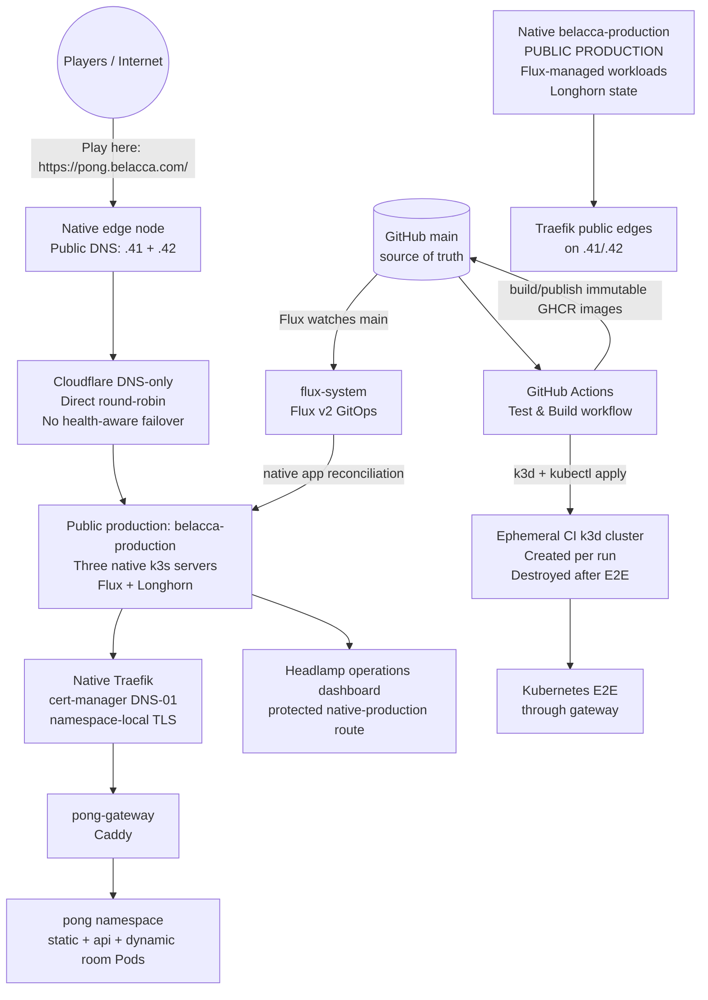

# 🏓 Cloud Native Pong

A minimalist, horizontally-scalable PONG game running on Kubernetes. Each game room is a dedicated pod — demonstrating the power of cloud-native architecture with near-zero overhead.

## ✨ Features

- **Zero-auth** — Just pick a name and play. No accounts, no passwords.
- **1 room = 1 pod** — Every game room runs in its own isolated pod. Scale infinitely.
- **Blazing fast** — Go binary (~6 MB), distroless runtime image, and low-latency WebTransport with a WebSocket fallback.
- **Embedded SQLite** — Pure Go, CGO-free, no external database needed.
- **Self-cleaning** — Rooms auto-terminate when the game ends. No orphaned pods.
- **Multi-service** — Gateway, static, API, room: each scales independently.
- **Play vs Computer** — A deterministic browser-side heuristic AI works offline; no LLM, model, or network service is required.
- **Mobile-ready** — Responsive canvas layout and touch paddle controls work alongside keyboard controls.

## 🏗 Architecture

```
                     ┌──────────────┐
                     │   Gateway    │  (Caddy, 1 replica, NodePort)
                     │   :80        │
                     └──────┬───────┘
        ┌───────────────────┼───────────────────┐
        ▼                   ▼                   ▼
 ┌──────────┐     ┌──────────────┐     ┌──────────────┐
 │  Static   │     │   API/Lobby  │     │  Room Pods   │
 │ (Caddy)  │     │  (Go, 1 rep) │     │ (Go, dynamic)│
 │  /        │     │  /api/*      │     │  /rooms/*    │
 └──────────┘     └──────┬───────┘     └──────────────┘
                         │ SQLite (PVC)
                         │ K8s API (creates room pods)
```

### Component responsibilities

| Component | Image | Replicas | Purpose |
|-----------|-------|----------|---------|
| **Gateway** | `cloudnativepong-gateway` | 2 production / 1 local | Caddy HTTP entry point, routes by path |
| **Static** | `cloudnativepong-static` | 2 production / 1 local | Serves HTML, CSS, JS via Caddy |
| **API** | `cloudnativepong-api` | 1 | Room CRUD, K8s pod orchestration, WebSocket-compatible proxy, optional WebTransport endpoint |
| **Room** | `cloudnativepong-room` | N (dynamic) | One pod per game, runs PONG engine |

### Routing

```
/              → Static (index.html)
/api/*         → API (room management)
/rooms/{id}/ws → API (WebSocket-compatible fallback, proxies to room pod WebSocket)
/rooms/{id}/wt → API (optional native WebTransport, bridges to room pod WebSocket)
```

## 🚀 Quick Start

### Local Development (no Kubernetes)

```bash
# Single binary, lobby + rooms + static in one process
go run . --mode=local

# Open http://localhost:8080
```

The lobby also provides **Play vs Computer (AI)**. This mode runs entirely in
the browser: it uses a small deterministic prediction heuristic, does not create
a server room, and does not call an LLM or any external service. Keyboard W/S
and the on-screen Up/Down touch buttons control the human paddle.

The workspace [fast development-loop guide](https://github.com/macel94/belacca-platform/blob/main/docs/development-loop.md)
describes why local process mode is the default inner loop, how Kubernetes-
dependent changes should use an isolated warm development environment, and why
native production and its Flux promotion path must not be used for every edit.

### Docker Compose (local multi-service)

```bash
# Build all images
docker build -t cloudnativepong-api:latest -f Dockerfile.api .
docker build -t cloudnativepong-room:latest -f Dockerfile.room .
docker build -t cloudnativepong-static:latest -f Dockerfile.static .
docker build -t cloudnativepong-gateway:latest -f Dockerfile.gateway .

# Run with docker-compose (create a compose file or use k3d)
```

### On Kubernetes (k3d for local, any K8s for prod)

```bash
# Create a local K8s cluster (fast feedback loop).
# Map host port 8080 to this app's gateway NodePort 30080.
k3d cluster create pong --agents 2 --port 8080:30080@agent:0

# Build and load images
podman build -t cloudnativepong-api:latest -f Dockerfile.api .
podman build -t cloudnativepong-room:latest -f Dockerfile.room .
podman build -t cloudnativepong-static:latest -f Dockerfile.static .
podman build -t cloudnativepong-gateway:latest -f Dockerfile.gateway .
k3d image import cloudnativepong-api:latest cloudnativepong-room:latest \
  cloudnativepong-static:latest cloudnativepong-gateway:latest -c pong

# Deploy
kubectl apply -k k8s/overlays/test

# Open http://localhost:8080
```

## 🌐 Environments, Operations, and GitOps

### Public play URL

Cloud Native Pong is hosted at:

- **[https://pong.belacca.com/](https://pong.belacca.com/)**

The portfolio aliases `belacca.com`, `www.belacca.com`, and
`www.francesco.belacca.com` redirect to the canonical personal site at
`https://francesco.belacca.com/`. The complete platform site inventory is in
[`macel94/belacca-gitops/docs/SITES.md`](https://github.com/macel94/belacca-gitops/blob/main/docs/SITES.md).
Open the Pong subdomain, enter a display name, and create or join a room.
Browser WebSocket-compatible connections are served over TLS. The browser checks
`/api/capabilities` and only uses native WebTransport when a reviewed UDP
listener is advertised; otherwise WebSockets remain the default.

Native `belacca-production` is the public production cluster. Native Traefik
serves `pong.belacca.com` on `.41` and `.42`; Cloudflare DNS-only records use
direct round-robin rather than health-aware failover. Native cert-manager uses
Cloudflare DNS-01 and namespace-local TLS Secrets. The retired old `k3d-pong`
ACME/PVC state was not mounted into native Traefik.

Host-based routing is owned by the public
[`macel94/belacca-gitops`](https://github.com/macel94/belacca-gitops) repository;
this repository owns Pong workloads and immutable images. Pong's production
SQLite state is on a Longhorn-backed RWO PVC with one API writer. See
[`DEPLOYMENT.md`](DEPLOYMENT.md) for deployment, restart, and recovery
boundaries.

### Cluster layout

Native `belacca-production` is the live player-facing cluster. GitHub Actions
also creates disposable k3d test clusters; those CI/restore clusters are never
production targets. The former `.73` k3d runtime is retired historical
reference only.



| Role | kubeconfig context | Target | Access | Status |
|------|--------------------|--------|--------|--------|
| Native production | `belacca-production` | Native k3s; Traefik on `.41` and `.42` | Public Pong URL and Flux-managed workloads | Running; public traffic is native |
| Retired old production | historical `k3d-pong` | Former k3d cluster on `.73` | Audit/reference only | Retired after state handoff |
| CI integration test | generated/ephemeral | Disposable k3d cluster | Job-local gateway on `localhost:8080` | Created, tested, and deleted by CI |

The native `pong` namespace is reconciled by the platform
`macel94/belacca-gitops` repository. Its native Pong Kustomization consumes this
repository's shared [`k8s/overlays/server/`](k8s/overlays/server/) application
overlay. Host routing, TLS, and Flux ownership are declared in GitOps; do not
recreate the retired k3d runtime or delete the native SQLite PVC.

To inspect native production:

```bash
kubectl config use-context belacca-native
kubectl get nodes -o wide
kubectl -n pong get deploy,pods,svc,ingress,hpa,pvc
kubectl -n flux-system get pods
```

Do not use native production as an experiment sandbox. CI and restore clusters
must have their own context and must not share the production PVC or public
route. Longhorn must remain healthy and SQLite must remain single-writer.

### Native production operations and hardening

Native production is live. The following ongoing controls remain important:

- **Public edge:** Traefik serves `.41` and `.42`; Cloudflare DNS is direct
  round-robin rather than health-aware failover. Remove an unhealthy address
  manually until a load balancer is provisioned.
- **Certificate ownership:** cert-manager uses Cloudflare DNS-01 and
  namespace-local TLS Secrets. Do not mount the retired `traefik-acme` state.
- **Longhorn storage:** keep the native Longhorn volumes healthy and retain
  the reviewed RWO PVC contracts. Do not scale the SQLite API beyond one writer.
- **SQLite operations:** stop/fence the writer before any copy, run integrity
  checks, restore only to an approved isolated/native target, and verify the
  application after restart.
- **Reconciliation:** change routing, images, and workload configuration only
  through reviewed platform GitOps; do not recreate the retired `.73` runtime.

### GitOps workflow

Kubernetes application changes are managed with **Flux v2 GitOps**. Git is the
source of truth; do not use a manual `kubectl apply` as the permanent production
deployment mechanism. The cluster-level source of truth is
[`macel94/belacca-gitops`](https://github.com/macel94/belacca-gitops); this
repository is one independently reconciled application source.

1. Work locally and run the Go, lint, and Playwright tests. Pull requests run
   local-mode E2E tests and build all four container images. The Kubernetes E2E
   job also creates a disposable k3d cluster and tests through the gateway.
2. Merge the reviewed change into `main`.
3. `.github/workflows/publish-images.yml` builds and publishes immutable
   `sha-<commit>` images to GHCR for `api`, `room`, `static`, and `gateway`.
4. The workflow updates `k8s/overlays/server/` with those image tags and commits
   the generated deployment update.
5. Flux watches `main` at one-minute source intervals. The platform
   repository's old-production root reconciles this repository's
   `./k8s/overlays/server` application source every ten minutes. Force an
   immediate sync when needed:

   ```bash
   flux reconcile source git flux-system -n flux-system
   flux reconcile kustomization flux-system -n flux-system --with-source
   flux get sources git -A
   flux get kustomizations -A
   ```

The Flux source and kustomization should both report `Ready=True` after a
successful deployment. The platform repository owns the generated Flux
bootstrap manifests and old-production root; application manifests and
environment patches for Pong are under `k8s/overlays/server/`.

### Kubernetes dashboards and administrative access

#### Installed dashboard: Headlamp

[Headlamp](https://headlamp.dev/) is installed by Flux from the pinned official
Headlamp Helm chart (`0.44.0`). Its Service is `ClusterIP` only, there is no
Ingress or NodePort, and it is not connected to the public Pong route. The native-production installation is declared in the
`macel94/belacca-gitops` platform repository; do not install or upgrade it
manually with `kubectl` or Helm. Its protected public route is
`https://dashboard.belacca.com/`, backed by Dex/Google OIDC and OAuth2 Proxy.

The dashboard's pod uses the fixed `headlamp` ServiceAccount. Its mounted token
is the shared backend identity, and the platform repository binds that
ServiceAccount to the built-in `cluster-admin` ClusterRole through the
`headlamp-authenticated-admin` binding. Authenticated native-production
Headlamp is therefore shared-admin, not read-only; the Dex/OAuth2 Proxy
allowlist is the front-door authentication gate, not per-user Kubernetes RBAC
or impersonation.
Headlamp's `unsafeUseServiceAccountToken` is enabled for this backend identity,
while Helm-operation features remain disabled.

For a private native-production diagnostic, use the native kubeconfig context
and a localhost-only port-forward only when the protected public identity route
is unavailable. Keep this command running while using the browser:

```bash
kubectl config use-context belacca-native
kubectl -n headlamp port-forward --address 127.0.0.1 service/headlamp 8080:80
```

Then open **[http://127.0.0.1:8080/](http://127.0.0.1:8080/)** on the machine. Headlamp
will ask for a Kubernetes bearer token. This is a short-lived token for the
fixed shared-admin ServiceAccount, not a per-user credential. Generate it
locally and paste it directly into the browser; do not print, log, commit, or
send the token anywhere:

```bash
kubectl -n headlamp create token headlamp --duration=1h
```

The port-forward binds to localhost by default. Do not expose a new public
Ingress, NodePort, or load balancer from this application repository. If remote access is ever required, use an
authenticated private tunnel or identity-aware proxy with HTTPS and audited
RBAC instead. The public game URL remains intentionally separate and provides
no cluster-administration access. The persistent project target is administered
with `kubectl` and observed with Flux; CI and the guarded restore rehearsal use
only explicitly disposable k3d clusters:

```bash
kubectl config use-context belacca-native
kubectl get pods -A
kubectl -n pong get deploy,pods,svc,ingress,hpa,pvc
kubectl -n flux-system get pods
flux get sources git -A
flux get kustomizations -A
```

The public game URL is intentionally not a Kubernetes dashboard and does not
provide cluster-administration access. Keep Headlamp on its authenticated
native-production route or use a private port-forward/identity-aware proxy
rather than adding it to the public Pong ingress.

## 🔐 Supply-chain, synthetic checks, and recovery

The repository provides reusable helpers under `scripts/` and GitHub workflows:

- `.github/workflows/supply-chain.yml` builds each image locally, uploads a
  CycloneDX SBOM, and uploads a Trivy JSON report for HIGH/CRITICAL findings.
  Normal runs are report-only and ignore unfixed findings; use the manual
  `strict=true` input for a reviewed security run that fails on those findings.
- `.github/workflows/publish-images.yml` pushes the four immutable
  `sha-<commit>` tags with a registry SBOM and GitHub Artifact Attestations.
  `actions/attest@v4` creates signed SLSA provenance and pushes it to GHCR;
  `scripts/verify-attestation.sh` verifies the repository and publish workflow
  identity with `gh attestation verify`.
- `scripts/promote-digests.sh` accepts only exact GHCR digest references. Use
  `--verify-attestations` to verify all four GitHub provenance attestations
  before the release metadata becomes `verified`; without it the metadata is
  deliberately only `digests_resolved`. No separate signing executable, signing
  key, or manual signing workflow is required.

- `.github/workflows/synthetic-check.yml` is a scheduled/manual public check.
  It exercises `https://pong.belacca.com` by default. An out-of-band
  repository or organization variable `SYNTHETIC_PONG_URL` may override the
  target for an approved ingress and the optional `SYNTHETIC_AUTH_TOKEN` secret
  supports a protected front door. The check validates the homepage, health,
  room API CRUD, the exact room connection contract, two-player WebSocket
  assignment, playing state delivery, and post-disconnect room cleanup. It
  fails closed when the target is missing or any step is not executed.

Useful local dry runs do not require a registry, credentials, or scanners:

```bash
./scripts/supply-chain.sh sbom --target . --dry-run
./scripts/supply-chain.sh scan-fs --target . --dry-run
./scripts/supply-chain.sh scan-image cloudnativepong-api:local --dry-run
./scripts/verify-attestation.sh ghcr.io/macel94/cloudnativepong-api@sha256:$(printf '0%.0s' {1..64}) --dry-run
./scripts/synthetic-check.sh --dry-run
npm run test:synthetic
```

For a pushed image, resolve the digest from GHCR rather than relying on its
mutable tag, then verify the GitHub Artifact Attestation against the immutable
reference:

```bash
IMAGE=ghcr.io/macel94/cloudnativepong-api:sha-<commit>
docker buildx imagetools inspect "$IMAGE"
# After recording the displayed digest:
DIGEST=ghcr.io/macel94/cloudnativepong-api@sha256:<digest>
./scripts/verify-attestation.sh "$DIGEST"
```

`gh attestation verify` checks the GHCR image, repository identity, publish
workflow identity, OIDC issuer, and SLSA provenance predicate. A digest
identifies exact image bytes; the GitHub attestation proves how those bytes were
built and who published them. `release-metadata.json` and
`scripts/validate-release.py` make the pending, digest-resolved, and fully
verified states explicit. Treat a failed attestation as a release-policy
failure, not as permission to fall back to a mutable tag.

### SQLite backup and restore verification

`pong-api` owns `/data/pong.db` on the `pong-api-data` PVC. There is currently
no configured object-storage bucket, off-cluster backup service, retention
policy, encryption key, or scheduled backup Job. `scripts/backup-restore.py`
creates a local operator artifact and verifies it in a temporary directory;
it does not upload data or modify the live PVC. The opt-in
`scripts/restore-rehearsal.sh` can seed a copied, verified artifact into a newly
created `pong-restore-*` k3d cluster and check the restored API through its
isolated gateway. It refuses `k3d-pong`/`pong` and requires an explicit
acknowledgement before creating anything.

```bash
# Safe command preview; no cluster or filesystem changes.
./scripts/backup-restore.sh backup /path/to/pong.db ./artifacts/pong.db --dry-run

# On a maintenance copy (not a live byte-for-byte copy), create and verify.
./scripts/backup-restore.sh backup /path/to/pong.db ./artifacts/pong.db
./scripts/backup-restore.sh verify ./artifacts/pong.db
./scripts/backup-restore.sh self-test

# Isolated rehearsal; requires k3d, kubectl, Docker images, and explicit opt-in.
./scripts/restore-rehearsal.sh --backup ./artifacts/pong.db \
  --build-images \
  --i-understand-this-creates-an-isolated-cluster
```

The rehearsal verifies the artifact before cluster creation, copies it to a new
PVC, compares the source/PVC SHA-256, starts the app from that PVC, and checks
`/health` plus `/api/rooms` through a localhost-only gateway mapping. It cleans
up only its exact `pong-restore-*` cluster unless `--keep-cluster` is used.
The source file is never modified. The script uses SQLite's online backup API
when given a readable database and runs `PRAGMA integrity_check` on source,
backup, and restored databases. Because
the distroless API image contains no SQLite CLI, obtaining a copy from the live
PVC requires an operator-controlled maintenance window (see `DEPLOYMENT.md`).
Do not delete/recreate the cluster or PVC, and do not run restore against
`/data/pong.db` in place. A stronger rehearsal uses a separate disposable k3d
cluster and only a copied database/PVC; these helpers never destroy the existing
`k3d-pong` cluster.

## 🧪 Testing

```bash
# Fast local desktop suite (local mode)
npx playwright test --project=chromium

# Mobile Chromium emulation with touch input
npx playwright test --project=mobile-pixel-7

# Mobile Safari/WebKit emulation with touch input
npx playwright test --project=mobile-iphone-13-webkit

# K8s mode (full integration; the cluster gateway must already be running)
TEST_MODE=k8s npx playwright test --project=chromium
```

The static image build injects the exact source commit into
`static/build-info.js`:

```bash
podman build \
  --build-arg BUILD_SHA="$(git rev-parse HEAD)" \
  --build-arg BUILD_REPOSITORY=macel94/cloudnativepong \
  -t cloudnativepong-static:local \
  -f Dockerfile.static .
```

Every lobby and game page shows `sha-<short-sha>` in the top-right corner. The
badge links to the full GitHub commit, and `/build-info.js` is served with
`Cache-Control: no-store` so a rollout cannot leave the visible release marker
stale in the browser.

## 🔌 Real-time transport design

Kubernetes HTTP traffic enters through the Caddy gateway. It routes REST requests to the Go lobby, static assets to the static service, and `/rooms/{id}/ws` to the lobby's compatibility WebSocket proxy. When the optional native UDP listener is enabled, the browser instead uses `/rooms/{id}/wt` over WebTransport and the Go lobby bridges that session to the dynamically created room pod.

The lobby keeps the browser-facing HTTP connection hijacked because the gateway must receive the lobby's `101 Switching Protocols` response before it can enter WebSocket tunnel mode. The room-side connection uses `gorilla/websocket`, rather than copying the underlying TCP socket, so bytes buffered during the room handshake and WebSocket control frames are preserved.

Room capacity reservations and actual connections are separate lifecycle events: creating a room reserves the creator's slot, `/api/rooms/join` reserves the opponent's slot, and the room Pod calls the internal `started` callback only after both room-side WebSocket connections are accepted. A public WebTransport session is bridged to that same room-side contract. A disconnect or game completion calls the `finished` callback, while a waiting room that never starts expires after 10 minutes. The lobby reconciles these waiting rooms every minute. The internal callbacks are reachable through the API ClusterIP only, not through the public gateway.

The browser sends a small `{"type":"proxy-ready"}` message immediately after `WebSocket.onopen`. The lobby consumes that marker, releases the first room-to-browser frames only after the outer gateway handoff, and forwards all subsequent application messages. The browser-to-room relay validates masked client frames, reassembles fragmented messages, handles control frames, and enforces a 16 MiB message limit. The marker is harmless in local mode, where the browser connects directly to the in-process room handler.

Caddy's `/rooms/` reverse proxy streams WebSocket upgrades with a one-hour timeout. The browser first checks `/api/capabilities`; if a public WebTransport URL is advertised and the browser supports `WebTransport`, it opens a reliable bidirectional stream with length-prefixed JSON messages. Otherwise it uses the existing WebSocket route. WebTransport is opt-in through `PONG_WEBTRANSPORT_ADDR`, certificate/key paths, and `PONG_WEBTRANSPORT_PUBLIC_URL`; the current Traefik HTTP Ingress does not expose UDP, so the default deployment remains WebSocket-compatible.

## 📈 Application observability and reliability contract

`/metrics` exposes dependency-free Prometheus text format. Optional OpenTelemetry OTLP/HTTP tracing is available through `OTEL_EXPORTER_OTLP_ENDPOINT` or `OTEL_EXPORTER_OTLP_TRACES_ENDPOINT`; without either variable, tracing is a no-op and no collector is contacted. HTTP spans and W3C propagation use bounded route/status metadata only and never include room IDs, names, IPs, tokens, URLs, or request bodies. See `DEPLOYMENT.md` for the private collector contract.

`/metrics` exposes dependency-free Prometheus text format. Metrics are aggregate
fixed-name counters and gauges only: there are no labels, room IDs, names, IPs,
tokens, URLs, or request contents in telemetry. The registry also caps the
number of distinct metric names. The main metric families cover:

- HTTP request totals and 1xx/2xx/3xx/4xx/5xx outcomes;
- room create, join, start, finish, active/waiting/playing, and cleanup;
- Pod/Service create, list, delete, reconciliation, and failure outcomes;
- SQLite open/migrate/read/write/delete operation outcomes;
- admission rejection and WebSocket upgrade, active, assignment, disconnect,
  relay, callback, and write outcomes.

Every HTTP response receives `X-Request-ID` and `X-Correlation-ID`. IDs are
server-generated 128-bit lowercase hexadecimal values; inbound values are used
only when they match that exact format. IDs are not derived from client data and
are not written to application logs. Room callback requests forward only this
opaque correlation value. Application logs contain event/status information and
never log client IPs, names, tokens, room IDs, addresses, or response bodies.

Room lifecycle state is deliberately restart-safe. API joins reserve capacity
without starting a game; actual WebSocket connections trigger `playing`. Failed
Pod/Service deletion retains the database row for retry, while terminal Pods,
missing-Pod Services, and stale waiting rooms are cleaned by reconciliation.
The local and Kubernetes paths use the same idempotent lifecycle contract.

For a dependency-light bounded journey test, use the harness below. It measures
health, create, join, WebSocket, and cleanup latency, limits iterations,
concurrency, timeout, and total duration, emits aggregate JSON only, and never
prints a room identifier. `--dry-run` performs no network activity:

```bash
./scripts/load-smoke.sh --dry-run
LOAD_SMOKE_BASE_URL=http://localhost:8080 \
  ./scripts/load-smoke.sh --iterations=3 --concurrency=2
```

The harness is intended for local smoke/load checks and external test targets,
not as a replacement for a production rate limiter. Existing public synthetic
checks remain in `scripts/synthetic-check.sh`.

## 📊 Verification Status

- Local Go tests, race tests, vet, and static builds pass.
- The local Chromium suite passes 14/14, including build metadata, computer play, and online two-player play.
- Dedicated Pixel 7 and iPhone 13/WebKit touch emulation cover responsive layout, touch controls, and actual paddle movement.
- The production-style static image build was verified with a full source SHA, full commit URL, and `Cache-Control: no-store` metadata response.
- Isolated Chromium checks through the Caddy k3d gateway pass, including two-player joining.
- The full k3d suite passes 12/12 when host traffic is mapped to the gateway NodePort with `8080:30080@agent:0`. The earlier intermittent 11/12 result came from using the cluster's port-80 ingress path or an unstable `kubectl port-forward`, not from a reproducible room/proxy failure.

## 📁 Project Structure

```
.
├── main.go              # Entry point, routing, CORS, WS proxy
├── main_test.go         # WebSocket frame and relay tests
├── lobby/               # Lobby server (room management, K8s integration)
├── game/                # PONG game engine (server-side state machine)
├── db/                  # SQLite database layer
├── static/              # Frontend (HTML, CSS, vanilla JS)
│   ├── build-info.js     # Compile-time source SHA marker
│   └── Caddyfile         # Caddy config for static pod
├── gateway/             # Gateway config
│   └── Caddyfile         # Caddy routing and WebSocket upgrade rules
├── k8s/                 # Kubernetes manifests
│   ├── base/             # Shared resources and protected PVC contract
│   └── overlays/         # Server production and disposable test overlays
├── tests/               # Playwright E2E tests
├── Dockerfile.api       # Go binary → distroless (lobby mode)
├── Dockerfile.room      # Go binary → distroless (room mode)
├── Dockerfile.static    # Caddy + static files
├── Dockerfile.gateway   # Caddy HTTP gateway
└── README.md
```

## 🔧 Tech Stack

| Layer          | Choice                        | Why                                      |
| -------------- | ----------------------------- | ---------------------------------------- |
| Language       | Go 1.25+                      | Single binary, no runtime, tiny images   |
| Database       | SQLite (modernc.org/sqlite)   | Pure Go, embedded, zero ops              |
| WebSocket fallback | gorilla/websocket          | Compatibility path for browsers/ingresses without WebTransport |
| WebTransport   | quic-go/webtransport-go       | Native HTTP/3 reliable streams and datagrams |
| Gateway        | Caddy 2.10                    | HTTP routing and WebSocket proxy          |
| Static Server  | Caddy 2.10                    | Small static image with gzip              |
| Container      | distroless (Go), Caddy alpine | Minimal runtime attack surface            |
| Frontend       | Vanilla JS + Canvas           | No framework, instant load               |
| E2E Testing    | Playwright + TypeScript       | Reliable, cross-browser                  |
| Local K8s      | k3d                           | Lightweight, fast startup (~10s)         |

## 🎮 How to Play

1. Open the lobby page.
2. Enter a display name.
3. Click **New Room** (and share the link) or **Join** an existing room.
4. Use **W/S** (Player 1) or **↑/↓** (Player 2) to move your paddle.
5. First to 7 points wins!

---

**Made to demonstrate cloud-native scalability with minimal complexity.**